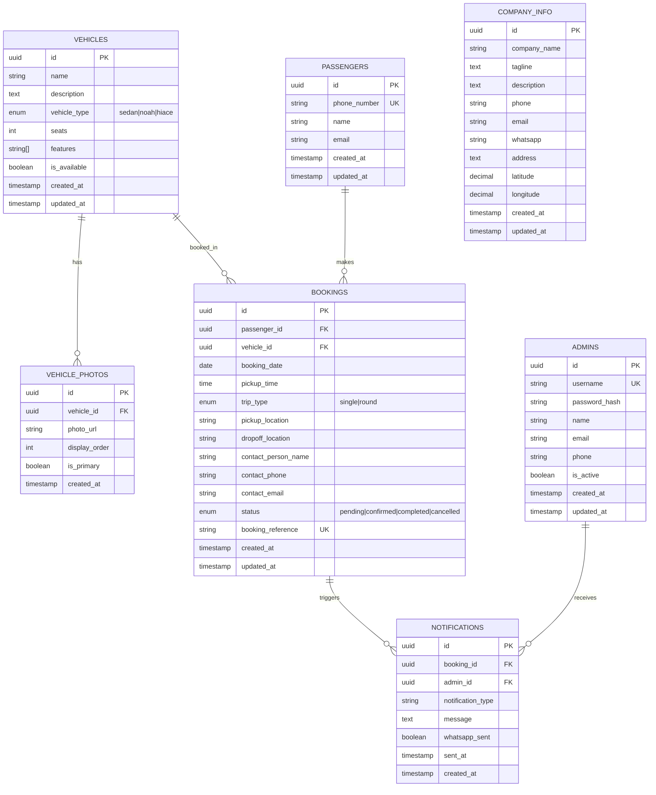

# Database Design - Rent-A-Car

## Overview
The Rent-A-Car database is designed using PostgreSQL with a simplified schema that supports the core functionality of the car booking platform. The design focuses on passenger bookings, vehicle management, and admin operations.

## Entity Relationship Diagram (ERD)



## Database Schema Details

### Core Entities

#### 1. Vehicles
- **Purpose**: Store vehicle information for the car rental company
- **Key Fields**: 
  - `vehicle_type`: Enum (sedan=4 seats, noah=7 seats, hiace=12 seats)
  - `features`: Array of vehicle features (AC, Bluetooth, GPS, etc.)
  - `is_available`: Boolean to control booking availability

#### 2. Vehicle_Photos
- **Purpose**: Store multiple photos for each vehicle
- **Key Fields**:
  - `display_order`: Controls photo display sequence
  - `is_primary`: Marks the main photo for the vehicle

#### 3. Passengers
- **Purpose**: Store passenger information (no registration required)
- **Key Fields**:
  - `phone_number`: Unique identifier for passengers
  - `name`: Passenger name (can be common)

#### 4. Bookings
- **Purpose**: Store all booking information
- **Key Fields**:
  - `trip_type`: Single trip or round trip
  - `booking_reference`: Unique reference for admin access
  - `status`: Booking lifecycle management

#### 5. Admins
- **Purpose**: Store admin user information
- **Key Fields**:
  - `username`: Admin login credential
  - `password_hash`: Encrypted password

#### 6. Company_Info
- **Purpose**: Store company information for landing page
- **Key Fields**:
  - Contact information (phone, email, WhatsApp)
  - Location coordinates for Google Maps

#### 7. Notifications
- **Purpose**: Track WhatsApp notifications sent to admins
- **Key Fields**:
  - `whatsapp_sent`: Track notification delivery
  - `sent_at`: Timestamp of notification

## Data Relationships

### One-to-Many Relationships
- **Vehicles → Vehicle_Photos**: Each vehicle can have multiple photos
- **Vehicles → Bookings**: Each vehicle can have multiple bookings
- **Passengers → Bookings**: Each passenger can have multiple bookings
- **Bookings → Notifications**: Each booking can trigger multiple notifications
- **Admins → Notifications**: Each admin can receive multiple notifications

### Constraints and Validation

#### Vehicle Type Constraints
- **Sedan**: Must have exactly 4 seats
- **Noah**: Must have exactly 7 seats  
- **Hiace**: Must have exactly 12 seats

#### Booking Constraints
- **Booking Date**: Must be current date or future
- **Trip Type**: Must be 'single' or 'round'
- **Status**: Must be one of the defined statuses

#### Phone Number Validation
- Must follow international phone number format
- Unique constraint on passenger phone numbers

## Sample Data

### Vehicle Types
```javascript
// Sample vehicle data
{
  name: "Toyota Camry",
  description: "Comfortable sedan for city travel",
  vehicle_type: "sedan",
  seats: 4,
  features: ["AC", "Bluetooth", "GPS"],
  is_available: true
}

{
  name: "Toyota Noah", 
  description: "Spacious van for family trips",
  vehicle_type: "noah",
  seats: 7,
  features: ["AC", "Bluetooth", "GPS", "Sliding Doors"],
  is_available: true
}

{
  name: "Toyota Hiace",
  description: "Large van for group transportation", 
  vehicle_type: "hiace",
  seats: 12,
  features: ["AC", "Bluetooth", "GPS", "Sliding Doors", "High Roof"],
  is_available: true
}
```

### Company Information
```javascript
// Sample company data
{
  company_name: "Rent-A-Car",
  tagline: "Your trusted car rental partner",
  phone: "+1234567890",
  email: "info@rentacar.com",
  whatsapp: "+1234567890",
  address: "123 Main Street, City, Country",
  latitude: 40.7128,
  longitude: -74.0060
}
```

## Database Operations

### Common Queries

#### Get Available Vehicles by Type
```sql
SELECT * FROM vehicles 
WHERE vehicle_type = 'sedan' AND is_available = true
ORDER BY name;
```

#### Get Passenger Bookings
```sql
SELECT b.*, v.name as vehicle_name, v.vehicle_type
FROM bookings b
JOIN vehicles v ON b.vehicle_id = v.id
WHERE b.passenger_id = $1
ORDER BY b.booking_date DESC;
```

#### Get Booking with Details
```sql
SELECT b.*, p.name as passenger_name, p.phone_number,
       v.name as vehicle_name, v.vehicle_type, v.seats
FROM bookings b
JOIN passengers p ON b.passenger_id = p.id
JOIN vehicles v ON b.vehicle_id = v.id
WHERE b.booking_reference = $1;
```

## Performance Considerations

### Indexing Strategy
- **Primary Keys**: All tables have UUID primary keys
- **Foreign Keys**: Indexed for join performance
- **Search Fields**: Index on vehicle_type, booking_date, status
- **Unique Fields**: Index on phone_number, booking_reference

### Optimization
- **Connection Pooling**: Use Prisma connection management
- **Query Optimization**: Efficient joins and filtering
- **Data Archiving**: Archive old bookings for performance

## Migration Strategy

### Prisma Migrations
- Use Prisma Migrate for schema changes
- Version control all migrations
- Test migrations on development first
- Backup before production migrations

### Data Seeding
- Seed sample vehicles and company info
- Create default admin user
- Test data for development

---
**Related Documents:**
- [System Architecture](architecture.md) - Overall system design
- [API Specifications](api-specifications.md) - API design and endpoints
- [Deployment Guide](deployment-guide.md) - Deployment instructions

*Last Updated: [Current Date]*
*Document Owner: Database Team*
